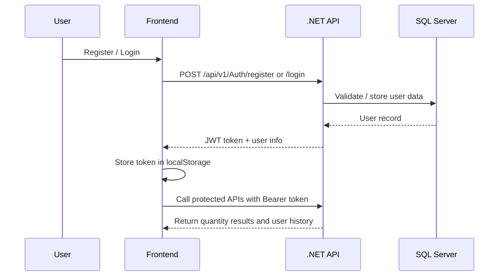

# Quantity Measurement System


A full-stack web application for performing **quantity comparison, conversion, and arithmetic operations** across multiple measurement types such as **length, weight, volume, and temperature**.  
The project is built with a **.NET 8 Web API** backend and a **responsive Vanilla JavaScript frontend**, following a clean **Controller → Service → Repository** architecture with **JWT-based authentication**, **SQL Server persistence**, and **user-specific history tracking**.

> **API Base URL:** `http://localhost:5109`

---

## ✨ Features

### Core Functionality
- 🔐 User registration and login
- 🛡️ JWT authentication and authorization
- ⚖️ Compare two quantities across compatible units
- 🔄 Convert values between supported units
- ➕➖➗ Perform add, subtract, and divide operations
- 🕘 Track each user's operation history
- ✅ Input validation and structured error handling

### Supported Measurement Types
- **Length**
- **Weight**
- **Volume**
- **Temperature**

### Frontend Experience
- Responsive UI built with **HTML, CSS, and Vanilla JavaScript**
- Modular JavaScript structure using `api.js`, `auth.js`, and `dashboard.js`
- Token-based session handling with protected dashboard access
- Clean forms for operations and history viewing

---

## 🛠️ Tech Stack

| Layer | Technologies |
|------|--------------|
| **Frontend** | HTML5, CSS3, Vanilla JavaScript |
| **Backend** | .NET 8, ASP.NET Core Web API, C# |
| **Architecture** | Clean Architecture, Controller-Service-Repository Pattern |
| **Authentication** | JWT Authentication & Authorization |
| **Database** | SQL Server, Stored Procedures, Entity Framework Core |
| **Testing** | MSTest |
| **API Docs** | Swagger / OpenAPI |

---

## 📁 Project Structure

```text
QuantityMeasurementApp/
├── BusinessLayer/
│   ├── Interfaces/
│   ├── Services/
│   └── Extensions/
├── ModelLayer/
│   ├── DTOs/
│   ├── Entities/
│   ├── Enums/
│   └── Exceptions/
├── RepoLayer/
│   ├── Context/
│   ├── Interfaces/
│   ├── Repositories/
│   ├── Persistence/
│   └── Migrations/
├── QuantityMeasurementApp.API/
│   ├── Controllers/
│   ├── Middleware/
│   ├── Program.cs
│   └── appsettings.json
├── Frontend/
│   ├── css/
│   ├── js/
│   ├── index.html
│   ├── login.html
│   ├── register.html
│   └── dashboard.html
├── QuantityMeasurementApp.Tests/
├── SQLQuery1.sql
├── SQLQuery2.sql
└── README.md
```

---

## 📡 API Endpoints Summary

### Authentication

| Method | Endpoint | Description | Auth |
|--------|----------|-------------|------|
| `POST` | `/api/v1/Auth/register` | Register a new user | No |
| `POST` | `/api/v1/Auth/login` | Login and receive JWT token | No |

### Quantity Operations

| Method | Endpoint | Description | Auth |
|--------|----------|-------------|------|
| `POST` | `/api/v1/QuantityMeasurement/compare` | Compare two quantities | Yes |
| `POST` | `/api/v1/QuantityMeasurement/convert` | Convert one unit to another | Yes |
| `POST` | `/api/v1/QuantityMeasurement/add` | Add two quantities | Yes |
| `POST` | `/api/v1/QuantityMeasurement/subtract` | Subtract two quantities | Yes |
| `POST` | `/api/v1/QuantityMeasurement/divide` | Divide two quantities | Yes |
| `GET` | `/api/v1/QuantityMeasurement/my-operations` | Get logged-in user's history | Yes |
| `GET` | `/api/v1/QuantityMeasurement/my-operations/{operation}` | Filter history by operation type | Yes |

> Swagger UI is available when the API is running in development mode at the application root.

---

## 🚀 Setup Instructions

### 1) Backend Setup

#### Prerequisites
- .NET 8 SDK
- SQL Server / SQL Server Express
- Visual Studio 2022 or VS Code

#### Steps
```bash
git clone <your-repository-url>
cd QuantityMeasurementApp
dotnet restore
dotnet build
cd QuantityMeasurementApp.API
dotnet run
```

Once started, the API should be available at:
- `http://localhost:5109`
- `http://localhost:5109/api/v1`

### 2) Database Setup (SQL Server)

1. Open **SQL Server Management Studio**.
2. Create a database, for example: `QuantityMeasurementDBB`.
3. Update the connection string in `QuantityMeasurementApp.API/appsettings.json`:

```json
"ConnectionStrings": {
  "DefaultConnection": "Server=localhost;Database=QuantityMeasurementDBB;Trusted_Connection=True;TrustServerCertificate=True;MultipleActiveResultSets=true;"
}
```

4. Run the provided SQL files:
   - `SQLQuery1.sql`
   - `SQLQuery2.sql`

5. If using EF Core migrations, run:

```bash
dotnet ef database update
```

### 3) Frontend Setup

1. Go to the `Frontend/` folder.
2. Confirm the API URL in `Frontend/js/api.js`:

```js
const API_BASE_URL = 'http://localhost:5109/api/v1';
```

3. Open `index.html` in the browser, or run the folder using **Live Server** for the best experience.
4. Register a user, log in, and access the dashboard.

---

## 🔐 Authentication Flow (JWT)



### Flow Summary
1. The user registers or logs in from the frontend.
2. The backend validates credentials and generates a **JWT token**.
3. The frontend stores the token and sends it in the `Authorization` header.
4. Protected endpoints verify the token before processing requests.
5. User-specific endpoints such as `my-operations` return only that user's history.

---

## 📸 Screenshots

> Add your screenshots to a `screenshots/` folder and update the paths below.

| Screen | Placeholder |
|--------|-------------|
| Landing Page | `./screenshots/home.png` |
| Login Page | `./screenshots/login.png` |
| Register Page | `./screenshots/register.png` |
| Dashboard | `./screenshots/dashboard.png` |
| Operation History | `./screenshots/history.png` |

---

## 🔮 Future Improvements

- Add **refresh token** support for stronger session management
- Introduce **role-based admin dashboard**
- Export operation history to **PDF / Excel**
- Add **Docker** support for easier deployment
- Improve automated testing with **integration and UI tests**
- Add charts and analytics for operation insights

---

## 👨‍💻 Author

**Saurabh Nagayach**  
Full-Stack Developer  
Built with a focus on clean architecture, secure authentication, and practical problem-solving.

---

## 📌 Summary

The **Quantity Measurement System** demonstrates full-stack development skills across:
- backend API design with **.NET 8**
- secure authentication using **JWT**
- database integration with **SQL Server**
- modular frontend development with **Vanilla JavaScript**
- clean architecture and maintainable project structure

If you want, I can also prepare a **short GitHub profile-style project description** or a **resume-ready project summary** for this repository.
